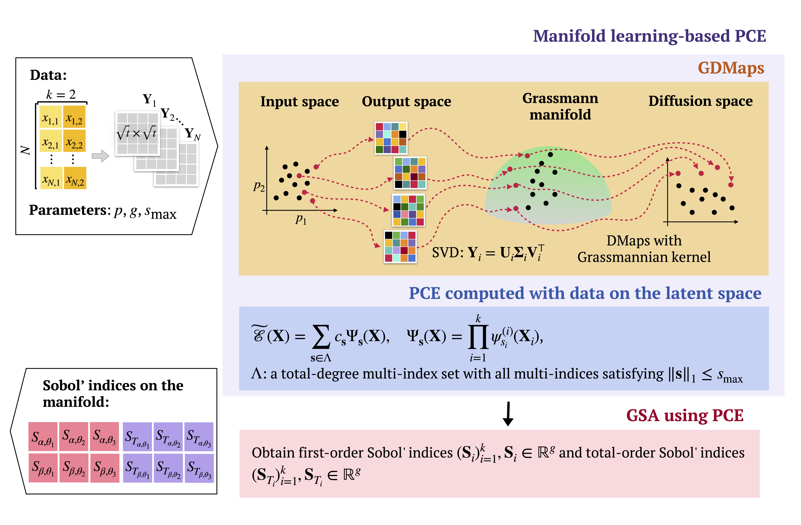

# Trajectory-based Global Sensitivity Analysis in Multiscale Models

## Table of contents

**Adapt in the end accordingly**

- [Overview](#overview)
- [Methodology](#methodology)
- [Repository Contents](#repository-contents)
- [Data](#data)
- [Getting Started](#getting-started)
- [Development](#development)
- [References](#references)

## Overview
This Git repository offers the code for implementing the concepts presented in the "Trajectory-based Global Sensitivity Analysis in Multiscale Models" paper. The paper introduces a new method for conducting global sensitivity analysis (GSA), tailored to accommodate the unique features of agent-based models (ABMs) used in modeling complex systems, which include diverse temporal dynamics and multi-level characteristics. The proposed framework employs Grassmannian diffusion maps (GDMaps) and sparse polynomial chaos expansion (PCE) to reduce data dimensionality and compute sensitivity indices for uncertain input parameters. The method is applied to three models: a classic Lotka-Volterra dynamical system, DeepABM-COVID, and a poverty trap formation ABM. 

## Methodology

<p align="center">
  
</p>

## Contents of the repository

**Add DeepABM?  -  then need to add Charles' (or a link to his repository)**

- `GSA_GDM_PCE`: Contains the source code for the proposed method.
- `notebooks`: Provides examples demonstrating the application of the method and includes the following files:
  - `GSA_results`: Contains the resulting data from applying the framework on the Lotka-Volterra (LV) model (located in the `LV` folder) and the DeepABM COVID-19 model (located in the `parsim` and `nonparsim` folders).
  - `input_data`: Contains the input data of parameter combinations sampled with a low-discrepancy sequence, which is required for running the code.
  - `pce_accuracy`: Contains the resulting plots generated when assessing the accuracy of the PCE.
  - `plots`: Contains all plots used in the paper (main text) and Supplementary Information (SI).
  - `DeepABM_PCE-GSA.ipynb`: Jupyter notebook demonstrating the application of the framework on the DeepABM COVID-19 model.
  - `DeepABM_SobolGSA.ipynb`: Jupyter notebook demonstrating GSA for the DeepABM COVID-19 model using conventional Sobol' index calculation methods over multiple time steps.
  - `GDMaps_PCE_LV.ipynb`: Jupyter notebook demonstrating the application of the proposed framework on the Lotka-Volterra (LV) model.
  - `GDMaps_unit_sphere.ipynb`: Jupyter notebook containing a simple example illustrating GDMaps' capability to capture intrinsic geometric structures, following the example previously used by [Dos Santos et al.](https://arxiv.org/abs/2009.07547).
- `Snellius_DeepABM`: This is not a stand-alone repository and contains files used to write data for the DeepABM COVID-19 model together with the [deepabm-covid](https://github.com/ayushchopra96/deepabm-covid.) repository.

## Data

**Data from DeepABM -?
Data from Charles -?**

To run with the original data, download it from [https://figshare.com/articles/dataset/data_zip/23515965](https://figshare.com/articles/dataset/output_data_zip/22216921) and add the unzipped folder named `output_data` into `notebooks` folder. `DeepABM_SobolGSA.ipynb` in the `notebook` folder contains code for writing datafile from the original data.

## Getting Started

**Add requirements**

1. Clone the repository:
```
git clone git@github.com:bazvalya/GSA_using_GDMaps_PCE.git
```
and navigate to it on the local machine:
```
cd GSA_using_GDMaps_PCE
```
2. Create a virtual environment (Python 3.10):
```
python3.10 -m venv new_environment_name
```
and activate it with:
```
source new_environment_name/bin/activate
```
3. Install the required packages with:
```bash
pip install -r requirements.txt
```

## Development

**paraphrase**

This repository is being actively developed. Our objective is to offer a collection of reusable code that enables researchers to replicate results effortlessly and leverage our framework for global sensitivity analysis. Whether you are aiming to reproduce our findings or explore novel applications, this repository provides the necessary tools and resources to support your endeavours.

## References 

**Add reference to the Charles' repo**

A substantial portion of our implementation stems from [GDM-PCE](https://github.com/katiana22/GDM-PCE). We express our gratitude to the contributors of the original repository for their valuable resources.
